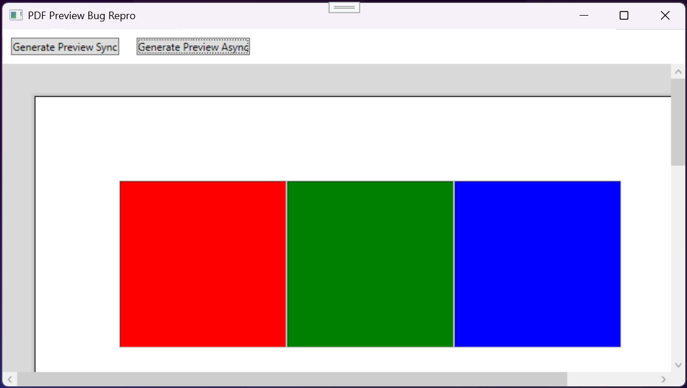
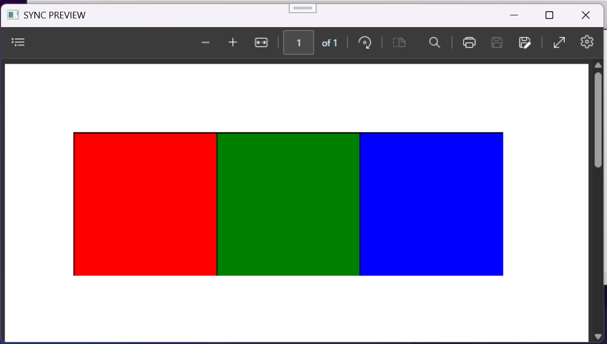
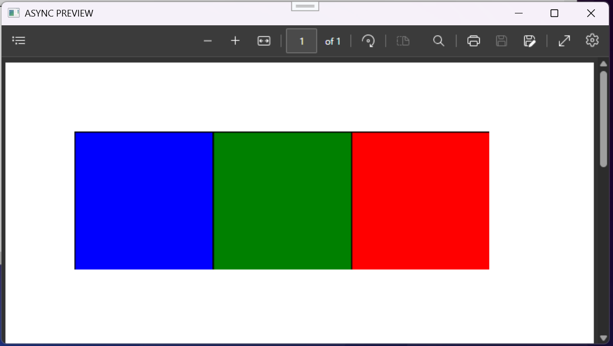

# TextControlTest Project

This project is reproducing a possible issue with the ServerTextControl PDF rendering.

## UPDATE: BUGFIX!

We have determined the cause of the problem and that is that the ServerTextControl MUST run on a STA thread to render correctly. The default behaviour of `Task.Run` is to execute on a MTA thread which is the cause of the problem.

Here is an example of how to run on an STA thread:
```
    private static Task<T> ExecuteOnStaThread<T>(Func<T> func)
    {
        var tcs = new TaskCompletionSource<T>();
        var thread = new Thread(() =>
        {
            try
            {
                tcs.SetResult(func());
            }
            catch (Exception ex)
            {
                tcs.SetException(ex);
            }
        });
        thread.SetApartmentState(ApartmentState.STA);
        thread.Start();
        return tcs.Task;
    }
```

The example application has been updated with a new button to render correctly off the main thread.


## Details

There seems to be a bug when rendering a document that contains shapes. When we try to save that document to PDF using the ServerTextControl component from a WPF application the colours of the shapes are not correct. It seems like the Red and Blue values are inverted (ie. red becomes blue and blue become red).
This problem only seems to occur when the code is run asynchronously (ie. off the main UI thread).


## Code example

The contained code example has two buttons, one to render the PDF synchronously demonstrating the correct behaviour, and one to render asynchronously to demonstrate the incorrect behaviour.

Original document in the example app:


Sync rendered PDF with red and blue correct:


Async rendered PDF with red and blue inverted:



### Repro steps
1. Create a document with some coloured shapes (using red and blue colours)
2. Save the document into the TX format.
3. Start a new Task/Background thread.
4. On a new thread, load the TX format into a new ServerTextControl.
5. On a new thread, save the ServerTextControl into a PDF format.
6. Save the PDF to file and view it.
